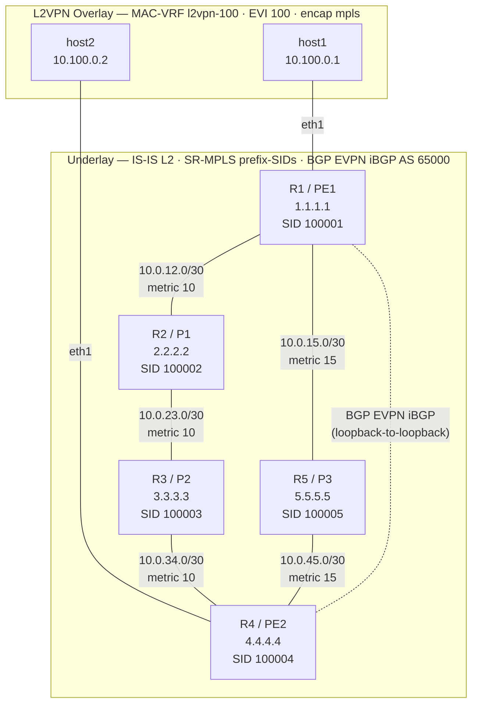

# SR-Linux L2VPN over SR-MPLS Lab

A 5-node ContainerLab topology using Nokia SR-Linux with an IS-IS IGP, Segment Routing MPLS (SR-MPLS) label distribution, BGP EVPN control plane, and an SR-MPLS data plane delivering an EVPN MAC-VRF L2VPN between two Alpine hosts.

## Why L2VPN over MPLS?

Traditional VLANs are confined to a single physical Layer 2 domain. VXLAN tunnels L2 over IP/UDP — practical in data centres but it bypasses the MPLS forwarding plane entirely. **L2VPN over MPLS** (EVPN-MPLS / VPLS) pushes Ethernet frames directly into MPLS-labelled packets, so every transit hop does a pure label-swap — no IP lookup in the P nodes. This models how carrier Ethernet/MPLS networks actually work.

## Why SR-MPLS?

**Segment Routing MPLS (SR-MPLS)** extends IS-IS with prefix-SID TLVs so that each node advertises a globally unique MPLS label for its loopback. There are no separate LDP sessions; the label plane is entirely driven by the IGP. Key properties:

| Aspect | SR-MPLS |
|--------|---------|
| Label scope | Globally significant — prefix-SID + SRGB = same label everywhere |
| Control plane | IS-IS TLV extensions (no extra protocol) |
| ECMP | Follows IGP ECMP paths automatically |
| PHP | Implicit-null SID (last-hop pop) |
| Fast reroute | TI-LFA (sub-50 ms, topology-independent) |
| Deployment era | Modern / greenfield networks |

## Topology

Two equal-cost P paths exist between PE1 and PE2 (IS-IS cost 30 each). SR-MPLS builds LSPs over both paths, giving **ECMP** load-sharing for the L2VPN traffic.

```
                      metric 10       metric 10
               ┌──── R2 (P1) ──────── R3 (P2) ────┐
               │   10.0.12.0/30    10.0.23.0/30    │  10.0.34.0/30
               │                                    │
host1 ──── R1 (PE1)                              R4 (PE2) ──── host2
10.100.0.1  1.1.1.1                              4.4.4.4   10.100.0.2
               │   10.0.15.0/30    10.0.45.0/30    │
               └──── R5 (P3) ────────────────────┘
                      metric 15       metric 15

 Path 1: R1 ─ R2 ─ R3 ─ R4   IS-IS cost = 10+10+10 = 30
 Path 2: R1 ─ R5 ─ R4        IS-IS cost = 15+15    = 30  ← ECMP
```



### How SR-MPLS builds the LSP

SR-MPLS uses IS-IS prefix-SID advertisements. Each node assigns a globally unique index within the SRGB (Segment Routing Global Block, e.g. 100000–100999). The label for any destination is always `SRGB_start + prefix-SID_index`.

The label stack on the wire (host1 → host2 via path R1-R2-R3-R4):

```
┌────────────────────────────────┬─────────────────────┬───────────────────┐
│ SR outer label (100004 = R4)   │ EVPN inner svc label│  Ethernet frame   │
└────────────────────────────────┴─────────────────────┴───────────────────┘

  R1  → pushes both labels (outer = SR SID for 4.4.4.4, inner = EVPN allocated label)
  R2  → swaps outer label only (inner label is opaque)
  R3  → penultimate hop pop (PHP) — pops outer label, forwards on inner label alone
  R4  → pops inner EVPN label, delivers raw Ethernet frame to host2's AC port
```

### Node roles

| Node | Role | IS-IS | SR prefix-SID | BGP EVPN | MAC-VRF |
|------|------|-------|---------------|----------|---------|
| R1 | PE1 | L2, passive lo | index 1 (label 100001) | yes — peer R4 | yes — AC = e1-2 |
| R2 | P (transit) | L2, passive lo | index 2 (label 100002) | no | no |
| R3 | P (transit) | L2, passive lo | index 3 (label 100003) | no | no |
| R4 | PE2 | L2, passive lo | index 4 (label 100004) | yes — peer R1 | yes — AC = e1-2 |
| R5 | P (alt path) | L2, passive lo | index 5 (label 100005) | no | no |

### IP addressing

| Node | Interface | Address | IS-IS metric |
|------|-----------|---------|-------------|
| R1 | system0.0 | 1.1.1.1/32 | passive |
| R1 | ethernet-1/1.0 | 10.0.12.1/30 → R2 | 10 |
| R1 | ethernet-1/3.0 | 10.0.15.1/30 → R5 | 15 |
| R1 | ethernet-1/2 | bridged AC → host1 | — |
| R2 | system0.0 | 2.2.2.2/32 | passive |
| R2 | ethernet-1/1.0 | 10.0.12.2/30 → R1 | 10 |
| R2 | ethernet-1/2.0 | 10.0.23.1/30 → R3 | 10 |
| R3 | system0.0 | 3.3.3.3/32 | passive |
| R3 | ethernet-1/1.0 | 10.0.23.2/30 → R2 | 10 |
| R3 | ethernet-1/2.0 | 10.0.34.1/30 → R4 | 10 |
| R4 | system0.0 | 4.4.4.4/32 | passive |
| R4 | ethernet-1/1.0 | 10.0.34.2/30 → R3 | 10 |
| R4 | ethernet-1/3.0 | 10.0.45.2/30 → R5 | 15 |
| R4 | ethernet-1/2 | bridged AC → host2 | — |
| R5 | system0.0 | 5.5.5.5/32 | passive |
| R5 | ethernet-1/1.0 | 10.0.15.2/30 → R1 | 15 |
| R5 | ethernet-1/2.0 | 10.0.45.1/30 → R4 | 15 |
| host1 | eth1 | 10.100.0.1/24 | — |
| host2 | eth1 | 10.100.0.2/24 | — |

## Stack

| Layer | Technology |
|-------|-----------|
| Underlay IGP | IS-IS Level-2 (point-to-point links) |
| Label distribution | SR-MPLS — prefix-SIDs advertised via IS-IS TLVs |
| ECMP | IS-IS equal-cost multipath → SR LSPs on both paths |
| Control plane | BGP EVPN iBGP AS 65000 (PE1 ↔ PE2, loopback-sourced) |
| Data plane | EVPN MAC-VRF `l2vpn-100` · EVI 100 · `encap-type mpls` |
| Router image | `ghcr.io/nokia/srlinux:latest` |
| Host image | `alpine:latest` |
| Orchestration | ContainerLab 0.73+ |

## Access

### Default credentials

| Field    | Value        |
|----------|--------------|
| Username | `admin`      |
| Password | `NokiaSrl1!` |
| SSH port | `22`         |

### From the ContainerLab host

```bash
# SR-Linux CLI
docker exec -it clab-srl-l2vpn-sr-mpls-r1 sr_cli

# Bash shell (if needed)
docker exec -it clab-srl-l2vpn-sr-mpls-r1 bash
```

### From a remote Linux machine (SSH)

ContainerLab assigns each node a management IP on `172.21.22.0/24`. Find them with:

```bash
containerlab inspect -t topology.yml
```

Then on the **remote machine**, add a route to the management subnet and SSH in:

```bash
# Add route via the ContainerLab host IP (replace with your actual host IP)
ip route add 172.21.22.0/24 via <containerlab-host-ip>

# SSH into any router
ssh admin@<node-mgmt-ip>
```

> The ContainerLab host must have IP forwarding enabled: `sysctl -w net.ipv4.ip_forward=1`

### gNMI / gRPC (port 57400)

```bash
gnmic -a <node-mgmt-ip>:57400 -u admin -p NokiaSrl1! --skip-verify get \
  --path /network-instance[name=default]/protocols/isis
```

## Prerequisites

- Linux host with Docker installed
- [ContainerLab](https://containerlab.dev) installed:
  ```bash
  bash -c "$(curl -sL https://get.containerlab.dev)"
  ```
- SR-Linux image (ContainerLab pulls it automatically on first deploy)

## Usage

```bash
# Deploy the full lab (run from repo root)
bash scripts/deploy.sh

# Automated PASS/FAIL checks
bash scripts/verify.sh

# Connect to a router
docker exec -it clab-srl-l2vpn-sr-mpls-r1 sr_cli

# Test L2 extension between hosts
docker exec clab-srl-l2vpn-sr-mpls-host1 ping -c3 10.100.0.2

# Tear down
bash scripts/destroy.sh
```

## Useful show commands (inside `sr_cli`)

```
# IS-IS adjacencies and link-state database
show network-instance default protocols isis neighbor
show network-instance default protocols isis database

# Full IP routing table — all 5 loopbacks should appear
show network-instance default route-table all

# SR-MPLS tunnel table — confirms prefix-SID LSPs are installed (ECMP shows 2 entries for 4.4.4.4)
show network-instance default tunnel-table all

# SR-MPLS label bindings from IS-IS
show network-instance default protocols isis segment-routing mapping-server

# BGP EVPN session state
show network-instance default protocols bgp neighbor
show network-instance default protocols bgp neighbor 4.4.4.4 advertised-routes evpn
show network-instance default protocols bgp neighbor 4.4.4.4 received-routes evpn

# L2VPN MAC-VRF — EVPN routes and learned MACs
show network-instance l2vpn-100 protocols bgp-evpn routes
show network-instance l2vpn-100 bridge-table mac-table all
```

## Convergence order

The three protocol layers must converge in sequence — each depends on the one below:

```
1. IS-IS    →  all loopbacks reachable via IP; prefix-SIDs advertised
2. SR-MPLS  →  LSPs installed in tunnel-table (derived from IS-IS, no extra protocol)
3. BGP      →  EVPN session between 1.1.1.1 and 4.4.4.4; IMET + MAC/IP routes exchanged
4. L2VPN   →  flood list built from IMET routes; host pings succeed
```

## Troubleshooting

| Symptom | First check |
|---------|-------------|
| BGP EVPN stuck in Active | `show network-instance default tunnel-table all` on R1 — `4.4.4.4` must appear as an SR tunnel before BGP can connect |
| Only one SR path to PE2 | IS-IS metrics: R1-R2-R3-R4 must equal R1-R5-R4 (both = 30). Check `show network-instance default protocols isis database` |
| Ping fails but BGP is Established | `show network-instance l2vpn-100 protocols bgp-evpn routes` on both PEs — IMET (Type-3) routes must be present to build the flood list |
| IS-IS not forming | Check interface IS-IS configuration; ensure `network-type point-to-point` matches on both ends |

## File structure

```
.
├── README.md
├── topology.yml                  # ContainerLab topology (nodes + links)
├── configs/
│   ├── r1/config.cli             # PE1: IS-IS + SR-MPLS + BGP EVPN + MAC-VRF l2vpn-100
│   ├── r2/config.cli             # P1 : IS-IS + SR-MPLS transit only
│   ├── r3/config.cli             # P2 : IS-IS + SR-MPLS transit only
│   ├── r4/config.cli             # PE2: IS-IS + SR-MPLS + BGP EVPN + MAC-VRF l2vpn-100
│   └── r5/config.cli             # P3 : IS-IS + SR-MPLS transit only (alternate path)
└── scripts/
    ├── deploy.sh                 # Deploy + convergence wait + status summary
    ├── destroy.sh                # Tear down and clean up
    └── verify.sh                 # Automated PASS/FAIL checks for all layers
```
